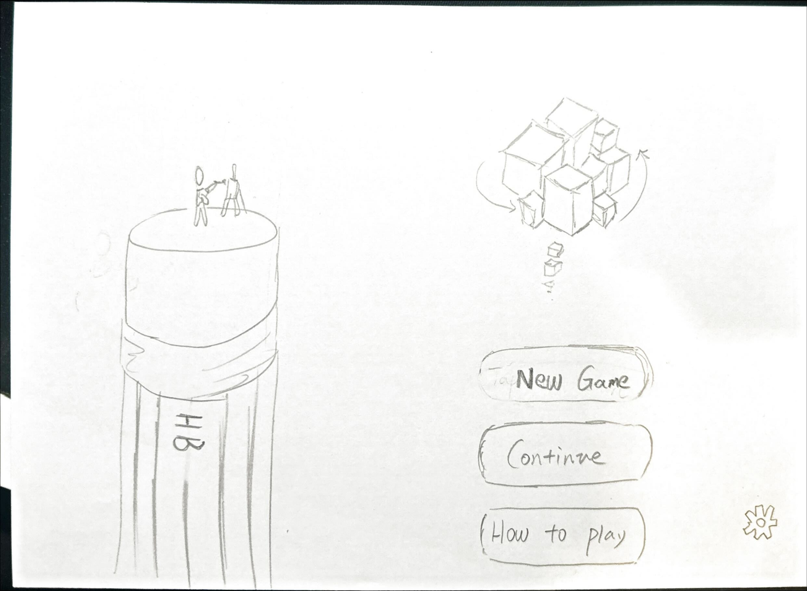
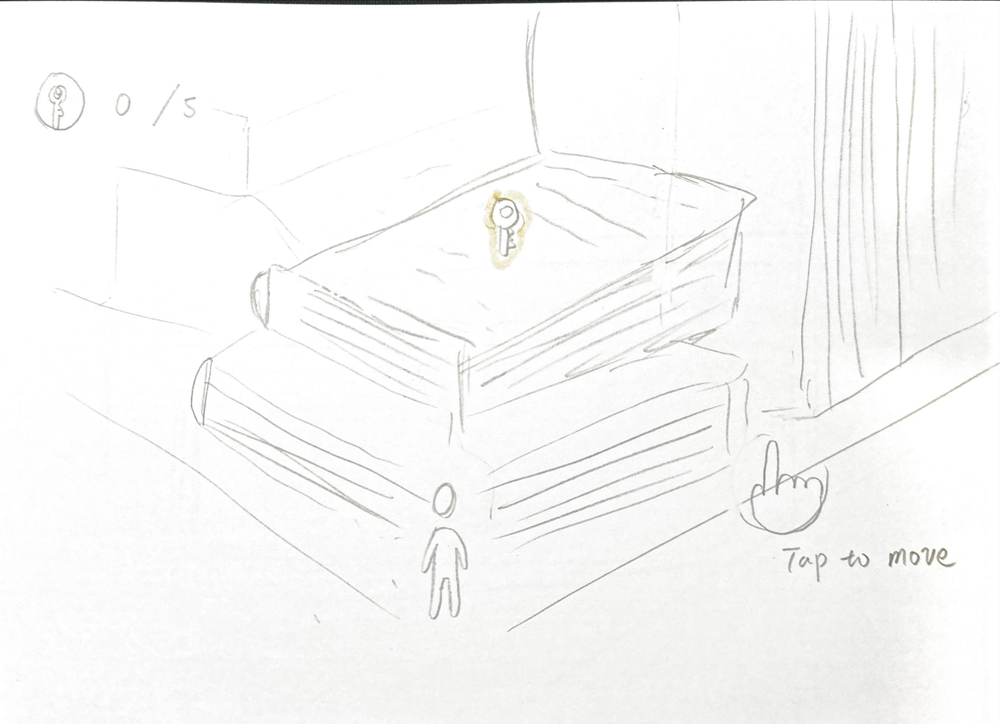
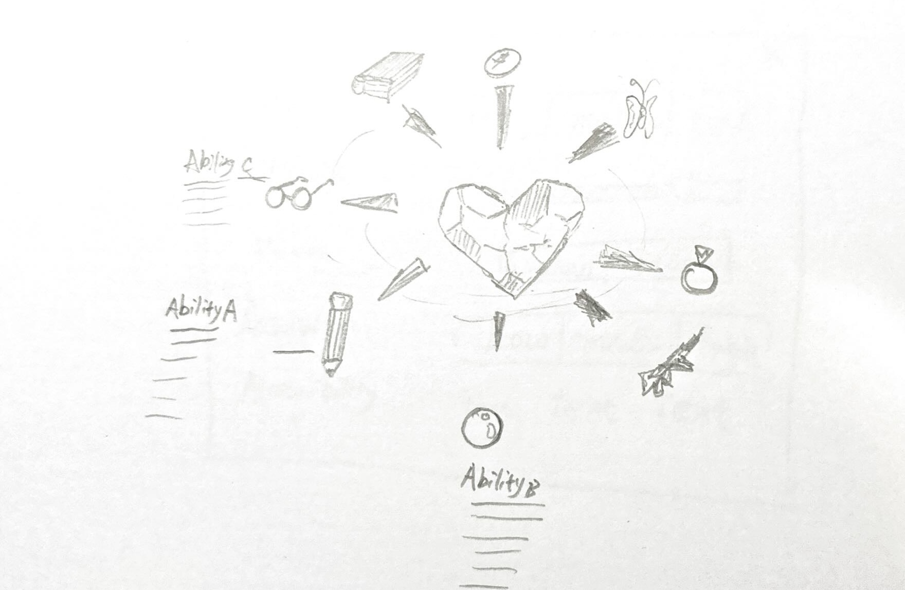
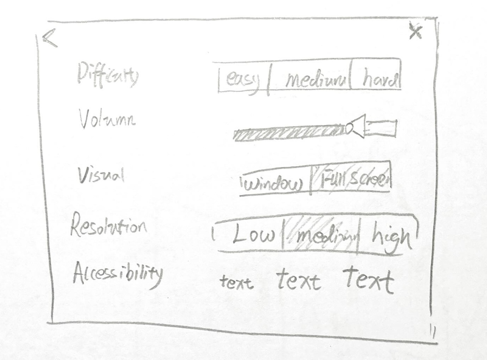
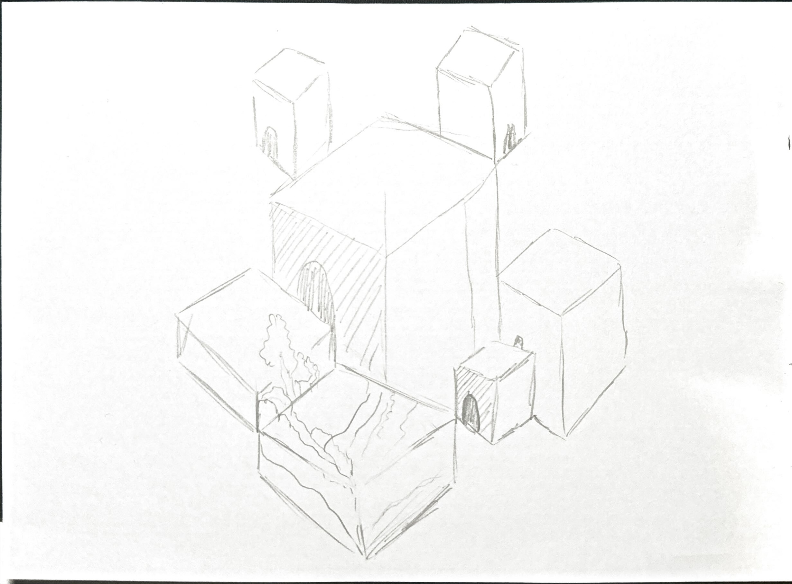
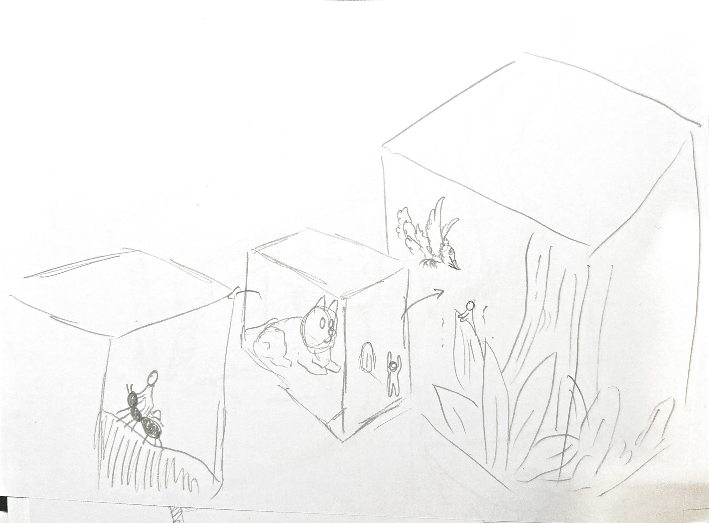
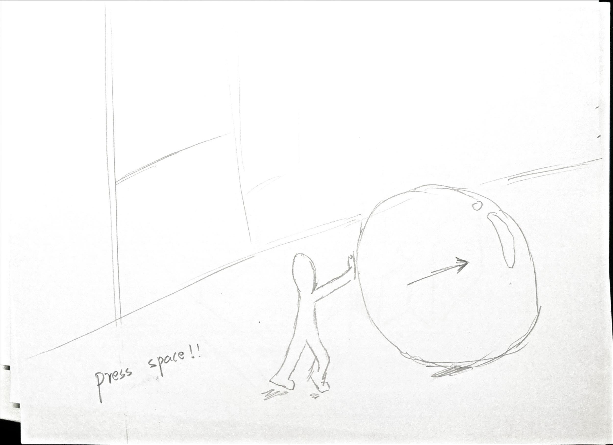
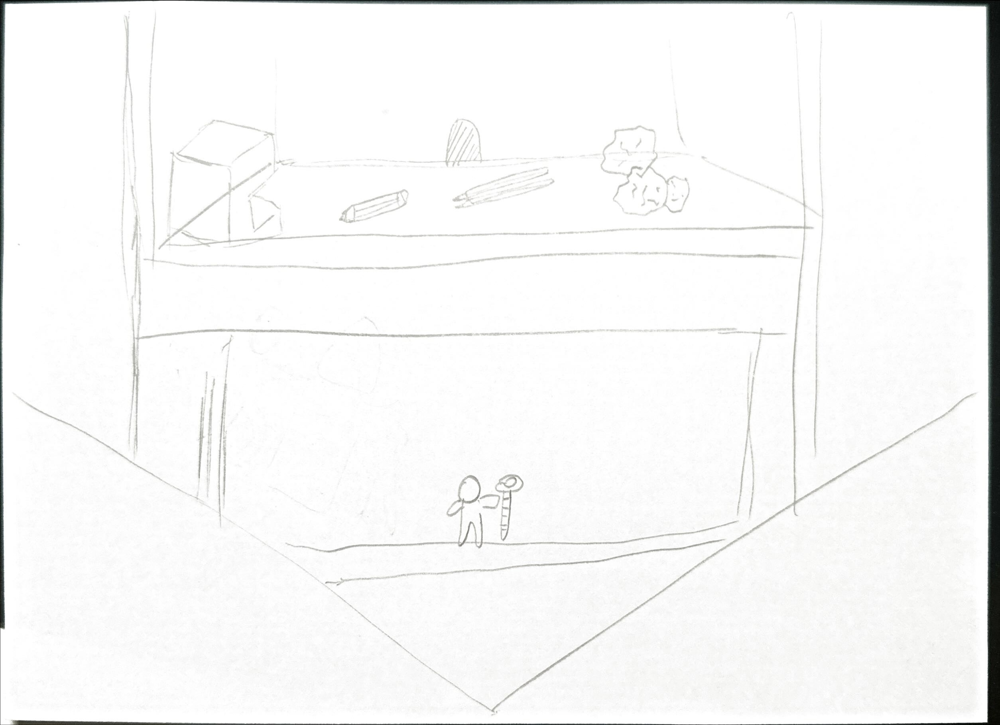
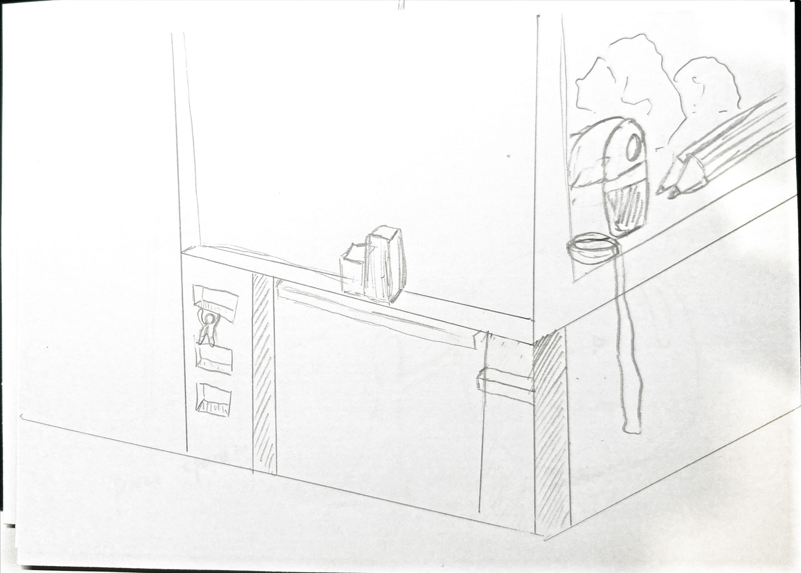
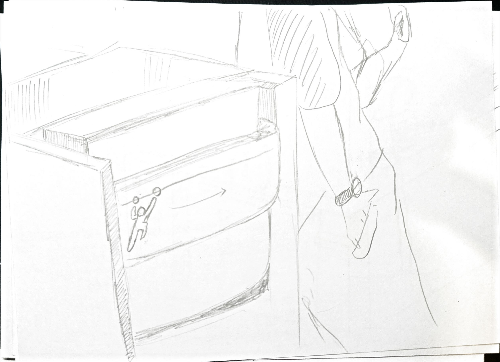

## Game Design Document

### Game: Memory Chambers
#### GDD Structure Explain

This Game Design Documentation includes three main parts:

1. Version Control
   - Explain how each version of the GDD changed and why
2. GDD main body
   - The main body of the **most recent version** of GDD
3. Appendix
   - Include all the previous version of GDD and change overview

---

## Version Control

- How version control works in this documents
  The GDD will present the latest version of our design. Version control within the document is managed on a section by section basis. Each section has its own version marker that is maintained independently, and only the sections that have changed will be updated. Previous versions will be archived in the Appendix.
- **Appendix will only archive previous versions of Game overview, Gameplay and Mechanics, and Levels and world design.** Remaining sections of the GDD will not be archived in Appendix.

#### Change Log

| Version | Version explain                                        | Update date                                            | Change overview                                              |
| ------- | ------------------------------------------------------ | ------------------------------------------------------ | ------------------------------------------------------------ |
| v0      | Initial GDD                                            | 15-09-2025                                             | Initial commit                                               |
| v1      | Draft and paper prototypes for the initial GDD         | designed in 20-09-2025, updated in 06-10-2025          | Add game design paper draft                                  |
| v2      | Redesign paper prototypes and ready for implementation | designed in 28-09-2025, updated in 03-11-2025     | Redesigned game levels after discuss prototype with teams.   |
| v3      | The final game to submit                               | continuously developed and final updated in 04-11-2025 | Implement all game level designed in prototype. Refined after evaluation |

#### Decisions and Actions Overview

Here record all the big decision made during development

| Version | Decision                  | Description                                                  |
| ------- | ------------------------- | ------------------------------------------------------------ |
| v2      | Change game level designs | The initial game level design have seven different game levels (room/cubic space) with each have unique design. This design was discussed to be impossible to implement considering the time constraints. Therefore, the second iteration of prototype only has three game levels design. The idea of travelling back and forth in these spaces to solve puzzles remains the same. |
| V3      | Reduce game level         | In implementation stages, due to time constraints, three game levels are reduced to have only two game levels. |

---

## Main Body

#### **Game Overview**
>  [!NOTE]
> **Version:** v2 & v3
> **Updated:** 03-11-2025 (designed in 28-09-2025)
> **Change Log:** Updated with slightly change in story

**Core Concept**

The core concept of this game is to gradually recover his dream and escape from the memory chamber created by the protagonist through puzzle-solving and exploration of the scene. 

This game story follows a man who is depressed and lost and tries to find a way out of two (originally three in v2 but reduced to two during implementation) interconnected spaces, Life, Work and Childhood, each reflecting his memories and emotions. Players must navigate these surreal spaces, interacting with objects, shifting perspectives, and manipulating the environment to find a way out, that is, to find the dream buried within him and relief. Gameplay focuses on environmental storytelling and problem solving: players experiment with object placement, explore transitions between large and small scales, and unlock new ways to perceive familiar spaces. The journey across Life and Work becomes both a puzzle and a metaphor, a reflective experience where every solved mystery reveals part of the protagonist's forgotten dream. Ultimately, escaping both worlds symbolizes awakening, rediscovering the dream within and reclaiming one's identity.

The game's uniqueness lies in the interweaving of memory, adventure, growth, and puzzle-solving. Players are not merely solving puzzles but embarking on a journey of self-reconstruction and exploration.

**Related genre(s)**

- Genres:
  - Main Genre: Puzzle Solving Adventure
  - Relevant Genre:  Spatial and Environmental Puzzle, Isometric View, Diorama, Abstract
- Related game:
  - Monumental Valley
    - Isometric camera view
    - Optical and spacial illusion
  - Superliminal 
    - Scaling object through perception
  - The Room
    - Unlock layers of puzzles through interact with boxes
- Differentiation
  - Our game has **two** different space. Solving puzzles require travelling back and forth in these spaces.
  - Scale shifting mechanics that impacts both objects and players. Core of our game
  - Variety of gameplay in each room. 

---

#### **Story and Narrative**

>  [!NOTE]
>  **Version:** v2 & v3
>  **Updated:** 03-11-2025 (designed in 28-09-2025)
>  **Change Log:** Updated story

- **Backstory**
*Our game is not a heavily narrative-driven experience (not like an RPG). Instead, it tells its story through implication.*
The protagonist suffers a mental breakdown in middle age due to prolonged stress and anxiety, his consciousness pulled into a miniature inner world. **This is a world created by his dream and memories, nothing makes sense**. Here, his memories become blocks of cages. Players must navigate these surreal spaces, interacting with objects, shifting perspectives, and manipulating the environment to find a way out, that is, to find the dream buried within him and relief. 

- **Characters**
Protagonist: A middle-aged man crushed by stress, transformed into a tiny explorer within the miniature realm.

Memory Manifestations (interactive/static objects): Objects and memories transformed into story elements.

---

#### **Gameplay and Mechanics**

>  [!NOTE]
>  **Version:** v2 & v3
>  **Updated:** 03-11-2025 (designed in 28-09-2025)
>  **Change Log:** Update mechanics with paper draft

- **Player Perspective**
  This is a 3D game with isometric camera view. The camera will be fixed but will zoom in and out to follow player movement. The game level consists of seven connected room, player plays as our protagonist, moving and solving puzzle in each space.

- **Controls**
  Player control the protagonist moving through simple left mouse click on the floor of the space. Player can also interact with interactive objects by right clicking interactable objects, such as  door, book, buildings, ladder etc. There are also static objects in the space functioned as decoration. 

  - Click to move (left click)
  - Click to interacte (right click)
  
- **Progression**
  The game world consists of two connected room space in cubic room space. The goal of the game is to solve puzzle and find  in each space, and when puzzles are solved, game ends. Each space represents a scene from the protagonist's memory. Each space will have a unique game mechanics and gameplay (see "Levels and World Design" for detailed game level). 
  Outworld room is a large cubic room space that contains all two room spaces. When a puzzle solved in a room space, the configuration and position of these two rooms within will change to form a path for players to go to a different room space to solve puzzle. When all puzzles are solved, these two rooms within will combine as a large cuboid, where a new door will appear. Through this new door, player will be able to grow to a large scale. 
  We expect players to feel refreshing through the first few levels. 
  
- **Gameplay Mechanics**

  Following are some major mechanics 

  1. Scale: 
    - Room scale: 
      - Each room space has puzzle that requires players to be in different scale to solve.
      - Scale are changed by uisng doors. Some door will enlarge player and some will shrink them.
    - Room list (see level design for details):
      - **Outworld**
      - **Room Life**
      - **Room Work**
      - **Room Childhood**
      
    - Player scale: 
      - There are four different player scale: (taking the room as a 1x1x1 cube) 3/4 is Large (L), 1/4 is Small (S), 1/8 is Extral Small (XS). Notice this is a rough guide on scale not the actual size in game.
      - Player's strength will increase or decrease when they grow or shrink in scale. Allowing them to interact with heavy object when they grow, such as in the room work, they will need to be big to be able to push buildings.

  2. Object
  - Player can interact with interactive object, but they cannot interactive with static object.

    - Interactive Object List:
      - **Doors**: Players can interact with doors to enter another room space. Doors will be in closed form or opened form depends on different room design.
      - **Lever**: A large level in out world room where it requires players to be big (S size) to use. After triggering this lever, Room Life will move to be close to Room Work, to form a path allow player to go to Room Work.
      - **Book**: One specific book in Room Life. Player can interact with this book (right click to push this book) and this book will fall to form a new path to another door. 
      - **Time Doors**: A pair of special doors in Room Work. When player use this door, time will either moves forward or backwards. Building in this scene will either rise up or fall down (simulate a process of building construction). 
      - **Building**: Several buildings in Room Work, which can be pushed by player in size L. Each buildings has a corresponding blueprint brick. When all buildings are pushed on its blueprint brick, final door will open and game will end.
      - **Blueprint brick**: A brick on ground in Room Work, which requires a correpsonding building to be on it.

  3. Player
    - Player cannot jump, run, or climb a wall without any tools. 
    - Player can shrink or grow when using doors or other entrance.

  4. Room

    - Each room can be moved through certain mechanics inside the room. By moving it, it will connect or disconnect to another room, creating new paths to solve the puzzle.

---

#### **Levels and World Design**

>  [!NOTE]
>  **Version:** v2 & 3 
>  **Updated:** 04-11-2025 (designed in 28-09-2025)
>  **Change Log:** Update level design in v2, and implemented in v3 (room childhoold are removed due to time constraints)

**Overview**

- **Game World**
  This is a 3D game with isometric view. Camera will remain fixed but will zoom in and out accordingly. When player move in the space, the camera will also follows their movement smoothly, but it will always fixed to a isometric view. The game world consists of two connected spaces, where each space is a separate diorama in a cube shape. Player will need to solve puzzles in each room to unlock the entrance to the next space. Each space will have different game mechanic and gameplay. The major game mechanic is that when player using doors or entrance to enter a room space, they will either shrink or grow. 
- **Physics**
  - This game follows basic daily-life physics.
  - Protagonist can shrink or grow. 
  - Static object cannot be moved.
  - Interactive objects can be moved. Each interactive objects has different mechanics (see above mechanics part for details). 
  - Player can interact with interactive object, the effects vary depending on the interactive object.
  - Player cannot jump or climb a wall. 

**Game Level Design**

- **Overview**
  - The game world structure consists of two different rooms and a out world.
    - 1. Outworld
    - 2. Room Life
    - 3. Room Work
  - **‼️Note: Childhood room was orginial planned as part of the game level design but was removed due to time constraint when implementing v3.**

- **1. Outworld**

  

    <em>Outworld</em> 
    
  

​	The Out world is a space contains all other two rooms. There is a large door in the outworld as the final goal of the game. Player will need to find out how to change their scale to the size of the door to open it. When the door open, game ends.

​	Progression - During the game, player will need to go back and forth from rooms to rooms to solve puzzles. All rooms will move when certain mechanics are triggered and when all rooms are aligned into a single cuboid, a new door will open. This door will allow player to grow to a large scale. Through this mechanics, player can open the final door.

​	**Final output from game**

  <em>Outworld V3</em> 
  

- **2. Room Life**

  <em>Room Life</em> 
  

​	The room life represents the memory where protagonist is still studing in school. In this room, players goal is to change their scale to small (XS) by exit the room and re-enter the room. Then by pushing the specific book on bookshelf, a path that direct to a different door is unlocked. (see above design sketches for details).

​	Stage 1 - Player weak up and re-enter the room from above, become small.

​	Stage 2 - Player go to right book shelf and push a book, then go left, jump on the desk and go outside again. 

​	Stage 3 - Player re-enter the room with scale changed to S (use the door on left, demonstrated as a triangle marker on the ground, will always change player scale to S), player will be able to climb the bookshelf and walk through the path created by the book, exit the room using the door on right, which will change his scale to L.

​	Stage 4 - Player now becomes large scale in outworld. Then they can push the room life to be adjacent to room work, unlock a path to room work. (**In v3, this design was changed. Now player will need to be large scale to pull a lever in outworld, then the room life will move automatically **)

​	**Final output from game**

  <em>Room Life V3</em> 
  

- **3. Room Work**

  <em>Room Work</em> 
  

​	The room work represents the memory where protagonist are working every day and night. There are two mechanics in this room. Time door in the central building requires player to be small to use it. When entering the door on the right side, the time will move forward, and building will rise up. There are 4 stages of building to demonstrate the time passed by. There are also some blueprint bricks (sites) that are specific to each buildings. 

​	Every building consists of two parts. The lower parts are the same for all buildings and will be present in building stage 2 and 3. The upper part is specifc to each building and will only present in stage 4. Based on the combination of upper part and lower part, player can identify the corresponding blueprint brick to it. For instance, for the building with a cylindrical upper part, the corresponding blueprint brick (site) is the one with a rectangle representing lower part and a circle inside the rectangle reperesenting upper part .

​	The goal of the room is to use the Time door on the right to move time forward and find out what each building's upper part looks like. Then use the Time door on the left to move the time backwards to reveal some hidden blueprint bricks. Player will need to go outside and re-enter the room from another door to become large. Only in the large size, player can push buildings and move them to their corresponding blueprint bricks (site)

  <em>Room Work - Progression</em> 
  

**Note: The position of blueprint bricks are changed in v3 based on evaluation and test to reduce the difficulty. The effect of sun rise and fall are not implemented due to time constraints.**

​	**Final output from game**

  <em>Room Life V3</em> 
  

- **4. Room Childhood (removed in v3)**

  <em>Room Childhood (removed)</em> 
  

  <em>Room Childhood (removed)</em> 
  

**Above stage 5 is how the game will end in v3**

---

#### **Art and Audio**

>  [!NOTE]
>  **Version:** v2 & v3 
>  **Updated:** 04-11-2025 (designed during development)
>  **Change Log:** Update sound and art

- **Art Style**
Our game will adopt a comic/cartoon style art direction, featuring Moebius Art style. Following are some references of Moebius Art Style.

Following are some other Moebius art style we are looking.

  
  
  
  
  
  
  

  <b>Some other references showing what our game level might look like:</b>

  
  

- **Sound and Music**
  Sound and Music will focus on the theme of relaxing and calm. As our protagonist will experienced through their different memories, background music will also shift according to the scene. But the major tone is peaceful, gentle and soothing, implying our theme of healing and recovering yourself.

- **Assets:**
  We will be using art assets including models, textures, music and sound from online. We will also use Blender to create our own models. We will write our own shaders and integrate with these assets to achieve our intended art and render style.
  This part will be updated continuously. Following are some current source for our models:
- https://free3d.com/3d-models/obj
- https://assetstore.unity.com/zh-CN?srsltid=AfmBOorV8fOIl4uve9E7rTyQU-1u_tY34TRIlJg6N9vLlGTgYqO3Smv6
- https://www.gamedevmarket.net/

---

#### User Interface (UI)

>  [!NOTE]
>  **Version:** v2 & v3 
>  **Updated:** 04-11-2025 (designed during development)
>  **Change Log:** Update

UI design has relatively low priority, this will be updated later when games' features are completed.
**Concept**

- Minimalist art style, simple and clear to use.
- Considering our game is a puzzle game, all interfaces should maintain minimum amount of buttons and notifications. Allowing players to fully immersed in the world and focused on puzzle-solving experience.

- **Final**

Homepage

  

Gameplay interface (Hand as mouse)

  

Tool bar and ability interface

  

Setting

  

---

#### Technology and Tools

>  [!NOTE]
>  **Version:** v1 
>  **Updated:** 07-10-2025 
>  **Change Log:** No change from v0

- **Development Tools**
	- Unity 6.1.000.1.14f1
	- GitHub/GitHub Desktop
	- Rider
	- VSCODE
- **Art and Audio tools**
	- FMOD 2.03.09
		- FMOD for Unity 2.03.09 (Integration)
	- Blender
	- Affinity Designer 2
- **Collaboration and Management**
	- Trello
	- Miro
	- WeChat

---

#### Team Communication, Timelines and Task Assignment

>  [!NOTE]
>  **Version:** v1 
>  **Updated:** 07-10-2025 
>  **Change Log:** No change from v0

- **Role**

| Team Member | Specialised role             |
| ----------- | ---------------------------- |
| Joly Lin    | Art and Testing Analysis     |
| Yue Wang    | Audio and Visual Design      |
| Yao Chen    | Programming and level design |

| Shared Task                             |
| --------------------------------------- |
| 1. Game Design                          |
| 2. Shader Development                   |
| 3. Art assets (models, textures)        |
| 4. Integration between different assets |
|                                         |

- Each team member has a specialised role and task that they are responsible for managing and making decisions. We all will collaborate and contribute to shared task.

- **Collaboration Principle**
	1. All team members should constantly share their progress, ensure transparency.
	2. All team members should active engaged in team discussion and meeting
	3. Tasks should be balanced among team members.
- **Communication Method**
	- Communication Tool: WeChat
	- Team Meeting: 
		- Update Meeting: Every Wednesday 16pm
			- Team members update progress and discuss problems.
		- Weekly Review: Every Sunday 14pm
			- Team members share progress and discuss direction and tasks for next week.

- **Task Management**
	- Following is a copy of our Trello task management that will keep updating throughout the project.

| Development Process    | Plan                                                         |
| ---------------------- | ------------------------------------------------------------ |
| Week 1 (15/9 - 21/9)   | - Set up the development environment and complete the basic framework.    - Refine the light card design.   - Prepare the art and music assets - Finish prototype |
| Week 2 (22/9 - 28/9)   | Implement core mechanics. Finish scene design                |
| Week 3 (29/9 - 5/10)   | Implement core mechanics. Construct scene in Unity           |
| Week 4 (6/10 - 12/10)  | Integrate. Finish basic UI design                            |
| Milestone 4 Submission | Test and Review                                              |
| Milestone 5 Submission | Improve models, aesthetics, UI design                        |
---

#### Possible Challenges

| Risk Statement                                               | Mitigation Strategy                                          |
| ------------------------------------------------------------ | ------------------------------------------------------------ |
| Team member not very skilled at Unity                        | Team member should improve Unity skills through various ways. Watch online tutorials by Unity and practice using official game project. |
| We have learned Java before but development in C# can still be challenging. | Check Unity documentation for C#. Watch online tutorials and examples. |
| We do not have video game development experience, time management might be challenging. | Balance tasks and set reasonable goals for each week. Build the basic playable structure first, then start building complex mechanics. If a certain mechanic is too difficult to implement, hold a meeting to discuss whether to change it or not. |
| Art or audio assets can be possibly delayed                  | Use simple placeholder models to ensure mechanics and features are completed to meet milestone requirement. |
| Absent or illness                                            | Tasks should be reallocated properly. Other team members should assist in completing unfinished tasks, |

---

## Appendix

This part has all old versions of GDD (only the one has been changed)

#### **Game Overview (OLD)**

>  [!NOTE]
>  **Version:** v1 
>  **Updated:** 07-10-2025 
>  **Change Log:** Archived
>  **Status:** Archived
- **Core Concept**
The core concept of this game is to gradually reconstruct the protagonist's body through puzzle-solving and exploration of the scene. Players assume the role of a man who has lost fragments of his soul, exploring seven interconnected spaces. Each space represents a unique scene from the protagonist's memories. Players must solve puzzles, complete tasks, and collect body fragments. When all fragments are recovered, the protagonist will be restored to wholeness and reclaim his identity, leading the story to its final ending. Unlike traditional puzzle games, this title emphasizes not only logic and mechanics but also deeply integrates character growth with the puzzle-solving process. After acquiring body fragments, the protagonist gradually unlocks new abilities (such as switching perspectives or entering worlds of different scales), allowing players to access previously inaccessible areas. Through this growth journey, players progressively understand the game world's rules and learn to apply cross-space, cross-scale logic to solve puzzles. The game's uniqueness lies in the interweaving of memory, adventure, growth, and puzzle-solving. Players are not merely solving puzzles but embarking on a journey of self-reconstruction and exploration.

- **Related genre(s)**
	- Genres:
		- Main Genre: Puzzle Solving Adventure
		- Relevant Genre:  Spatial and Environmental Puzzle, Isometric View, Diorama, Abstract
	- Related game:
		- Monumental Valley
			- Isometric camera view
			- Optical and spacial illusion
		- Superliminal 
			- Scaling object through perception
		- The Room
			- Unlock layers of puzzles through interact with boxes
	- Differentiation
		- Our game has seven different space that are interconnected. Solving puzzles require travelling back and forth in these spaces.
		- Scale shifting mechanics that impacts both objects and players. Core of our game
		- Variety of gameplay in each room. Combine puzzle with other mini tasks like racing, fishing and building. But puzzle is the major gameplay.

- **Target Audience**
	- Players who enjoy cartoonish art style
	- Player who is patient about solving puzzles
	- Players who enjoy games like Monumental Valley, Inside, Superliminal, Manifold Garden etc.
	- Indie game lover
- **Unique Selling Points (USPs)**
    1. Scale shifting puzzle
	  - Player change scale and proportion when entering different space. Objects they carried also changed, unlock possibility for new puzzle-solving methods.
	2. Various gameplay
	  - Each space provide a unique mini tasks that introduced different gameplay.
	3. Cross space interaction
	  - Interconnected seven spaces require players to go back and forth in each space to solve puzzle (with object shifting between each scale). Player should have a "grand scheme" to beat the game.
	4. Beautiful and unique Moebious Art Style

#### **Story and Narrative (OLD)**

>  [!NOTE]
>  **Version:** v1 
>  **Updated:** 07-10-2025 
>  **Change Log:** Archived
>  **Status:** Archived
- **Backstory**
  *Our game is not a heavily narrative-driven experience (not like an RPG). Instead, it tells its story through implication.*
  The protagonist suffers a mental breakdown in middle age due to prolonged stress and anxiety, his consciousness pulled into a miniature inner world. Here, his memories become blocks of cages. Everyday spaces objects transform into giant mountainous obstacles or shrink into tiny gadgets. Childhood marbles roll like rocks, while school desks become a maze. The protagonist must explore his long-forgotten memories, experience this mysterious, alien space, solving puzzles to gradually reclaim fragments of himself, ultimately piecing together his body and soul.

- **Characters**
  Protagonist: A middle-aged man crushed by stress, transformed into a tiny explorer within the miniature realm.

Memory Manifestations (interactive/static objects): Objects and memories transformed into story elements， such as giant marbles and massive desks, serve as both cherished recollections and trials to confront.

Inner World (space): Seven interconnected miniature scenes representing distinct stages of the protagonist's life and emotional memories.

#### **Gameplay and Mechanics (OLD)** 

>  [!NOTE]
>  **Version:** v1 
>  **Updated:** 07-10-2025 
>  **Change Log:** Archived
>  **Status:** Archived
- **Player Perspective**
  This is a 3D game with isometric camera view. The camera will be fixed but will zoom in and out to follower player movement. The game level consists of seven connected room, player plays as our protagonist, moving and solving puzzle in each space.

- **Controls**
  Player control the protagonist moving through simple mouse click on the floor of the space. Player can also interact with interactive objects through clicking, dragging, and placing or dropping. Correspondingly, this action will be represented as protagonist pick, pull, throw and drop objects. There are also static objects in the space where players can interact by completing tasks. Space will have mechanics and trap where player can click or drag to trigger. For instance, a player can click a lever to hold and drag using mouse to pull the lever.

  - Click to move (left click)
  - Click to interacte (left click)
  - Hold an object to through (by click and hold)
  - Hold and move to drag (left click)
  - Click to climb (click a high ground, player will automatically climb if the height is in a appropriate range)

  

      <em>Player control (left part)</em> 
    
  

- **Progression**
  The game world consists of seven connected space in roughly cube space. The goal of the game is to solve puzzle and find "body fragment" hidden in each space, and when all body fragment are found, game ends. Each space represents a scene from the protagonist's memory. Each space will have a unique game mechanics and gameplay. Player will need to achieve different task to get body fragment and unlock the entrance to the next space.
  Each space are interconnected, which sometime requires player to use objects from previous space to solve puzzle. As more space are unlocked by players, some objects in the previous space that seems useless become useful. The gameplay will start simple and become more and more difficult when more spaces are unlocked. In the last space, player will need to think and review all space they unlocked previously to solve the final puzzle.
  We expect players to feel refreshing through the first few levels. 
  As more spaces are unlocked, players will need to solve increasingly challenging puzzles. By the final stages, they will need to review and re-explore previous spaces, combining all the experiences they had to complete the game journey.

- **Gameplay Mechanics**

- Following are some major mechanics (more mechanics might be added when gameplay of different space change)

  1. Scale: 

    - Room scale: 
      - Each space is in different scale, and when player entering a space, their scale will change accordingly.
    - Player scale: 
      - There are four different player scale: (taking the room as a 1x1x1 cube) 3/4 is Large (L), 1/2 is Medium (M), 1/4 is Small (S), 1/8 is Extral Small (XS)
      - Player's strength will increase or decrease when they grow or shrink in scale. Allowing them to interact with heavy object when they grow.

    

      <em>Player scale (right part)</em> 
      
    

    - Object to scale:
      - Interactive object that user carry from one space to another will also scale accordingly.
      - Player can throw object through certain entrance, the scale of the object will change accordingly when passing through the entrance.

  2. Object

    - Player can interact with interactive object, but they cannot interactive with static object unless they achieve certain task.
    - Object has material and weight. Fragile object can be break by hard object. 

  3. Player

    - Player cannot jump, run, or climb a wall without any tools. 
    - Player can acquire ability when they get each body fragment.
    - Player can shrink or grow when passing the space entrances or through ability.

  4. Room

    - Each room can be moved through certain mechanics inside the room. By moving it, it will connect or disconnect to another room, creating new paths to solve the puzzle.

  - 

      <em>Room mechanics</em> 
      
    

---

#### 

#### **Levels and World Design (OLD)**

>  [!NOTE]
>  **Version:** v0
>  **Updated:** 15-09-2025 
>  **Status:** Archived

- **Game World**
  This is a 3D game with isometric view. Camera will remain fixed but will zoom in and out accordingly. When player move in the space, the camera will also follows their movement smoothly, but it will always fixed to a isometric view. The game world consists of seven connected spaces, where each space is a separate diorama in a roughly cube shape. Player will need to solve puzzles, complete certain tasks (like racing or fishing) to acquire "body fragment" in a space, which will give the protagonist new ability and unlock the entrance to the next space. Each space will have different game mechanic and gameplay. The major game mechanic is that when player entering a space, they will either shrink or grow according to the set of relevant space. Any object they carried will also change to the scale of the space, which is crucial to solve puzzle. As an example, players will find themself moving from one space to another to get use of this scale-changing mechanic to change a scale of an object, which will solve a certain puzzle.

- **Objects**
  - Background
    - All background objects (set, furnitures, trees etc.) is static unless there is a special mechanic attached to it. Background scenery like sky and mountain will demonstrated using a image for optimisation purpose.
  - Interactive object
    - Interactive object includes objects where players use to solve puzzle and all the relevant dynamic design. This includes:
      - Chest fragments: From protagonist and locate in different spaces. When play successfully acquire it, it will automatically fit into players body and give player a certain abilities.
      - "Doors" (or other objects that allow players to go into another space): Through each "door", player will shrink or grow according to the space they went to, There will also be 3D to 2D shifting mechanics when using some doors.
      - Static objects: Static object refers to object that cannot be moved. But it can be acquire through specific task. For instance, a rock that blocks the way.
      - Interactive objects: Interactive objects refers to object that can be moved or collected by player. 
      - All objects will be listed here later.
- **Physics**
  - This game follows basic daily-life physics.
  - Protagonist can shrink or grow. When this happened, player will lose or gain strength that limited how they can interact with other objects. Their collisions will also change accordingly.
  - Static object cannot be moved, but can be break according to its material. For instance, glass wall can be break by throwing a rock.
  - Interactive objects can be moved. Each objects has different materials that follows the physics of the real world. Interactive object has weight, when player gain strength through changing scale, they will be able to move object with large weight.
  - Player can throw, drop, push, pull, and grab interactive object. 
  - Player cannot jump or climb a wall. 

- **Game Level Concept Draft**

- 

    
    
    
  

  

    
    
    
  

>  [!NOTE]
>  **Version:** v1 
>  **Updated:** 07-10-2025 
>  **Change Log:** Update level design concept draft
>  **Status:** Archived
**Overview**

- **Game World**
  This is a 3D game with isometric view. Camera will remain fixed but will zoom in and out accordingly. When player move in the space, the camera will also follows their movement smoothly, but it will always fixed to a isometric view. The game world consists of seven connected spaces, where each space is a separate diorama in a roughly cube shape. Player will need to solve puzzles, complete certain tasks (like racing or fishing) to acquire "body fragment" in a space, which will give the protagonist new ability and unlock the entrance to the next space. Each space will have different game mechanic and gameplay. The major game mechanic is that when player entering a space, they will either shrink or grow according to the set of relevant space. Any object they carried will also change to the scale of the space, which is crucial to solve puzzle. As an example, players will find themself moving from one space to another to get use of this scale-changing mechanic to change a scale of an object, which will solve a certain puzzle.
- **Objects**
  - Background
  	- All background objects (set, furnitures, trees etc.) is static unless there is a special mechanic attached to it. Background scenery like sky and mountain will demonstrated using a image for optimisation purpose.
  - Interactive object
  	- Interactive object includes objects where players use to solve puzzle and all the relevant dynamic design. This includes:
  		- Chest fragments: From protagonist and locate in different spaces. When play successfully acquire it, it will automatically fit into players body and give player a certain abilities.
  		- "Doors" (or other objects that allow players to go into another space): Through each "door", player will shrink or grow according to the space they went to.
  		- Static objects: Static object refers to object that cannot be moved. But it can be acquire through specific task. For instance, a rock that blocks the way.
  		- Interactive objects: Interactive objects refers to object that can be moved or collected by player. 
- **Physics**
  - This game follows basic daily-life physics.
  - Protagonist can shrink or grow. When this happened, player will lose or gain strength that limited how they can interact with other objects. Their collisions will also change accordingly.
  - Static object cannot be moved, but can be break according to its material. For instance, glass wall can be break by throwing a rock.
  - Interactive objects can be moved. Each objects has different materials that follows the physics of the real world. Interactive object has weight, when player gain strength through changing scale, they will be able to move object with large weight.
  - Player can throw, drop, push, pull, and grab interactive object. 
  - Player cannot jump or climb a wall. 

**Game Level Design**

  

    <em>Overall game level</em> 
    
  

- The game world structure consists of seven different rooms with each in a shape of cube. The game world is an arrangement of interlocking cubes shown above. Following are names for different room cubes.
  - Centre room: Located at the centre of the structure
  - Junk room: Located at the bottom of the structure
  - M1 M2 M3 M4: Located around the centre room
  - Exit room: Located above the centre room.
- The camera view will show the room in an isometric view. The camera will zoom in when player scale is small and it will zoom out with black background when player scale is large.

  

    <em>Overall level progression steps</em> 
    
  

- The progression is as follows: (sequence of the above draft is from top left to right, then right to left, then left to right)
  1. M1 to M2 to C: Player solve puzzle in room M1 and proceed to room M2 and to Room C (central)
  2. C to M3: Player get a crucial item, allow M1 to move to a new position
  3. M3 to C to M1: In the new posisiton, a new door open, allow player to change to a different scale. Player discover and trigger new gimmick, unlock M4.
  4. M1 to C to M4: Player enter M4
  5. Player unlock mechanics to allow M4 movement. Player move M1 and M4 to align it with M2, unlock a path to Junk room (J)
  6. M4 to M1 to M2 to J: Player go to J, get crucial item and unlock new puzzle in M3, which will allow movement of J
  7. M3 to C to M2 to J: Player unlcok movement in M3, and move J to be below C, which unlock a path from J to E (from bottom to the top)
  8. J to C to E: Player enter Exit room (E)
  9. Move M1 M2 M3 M4 down, unlock the final door in E
  10. Player exit from E, Game Over.

  

    <em>Camera move</em> 
    
  

- This draft shows how camera will move and shift when players enter from one space to another (from one room to another). There will be a short cutscene to cover the scale shifting animation when using the door to enter another room, allowing a smooth transition.

#### **Art and Audio **

#### User Interface (UI) 

#### Technology and Tools 

#### Team Communication, Timelines and Task Assignment

#### Possible Challenges 

