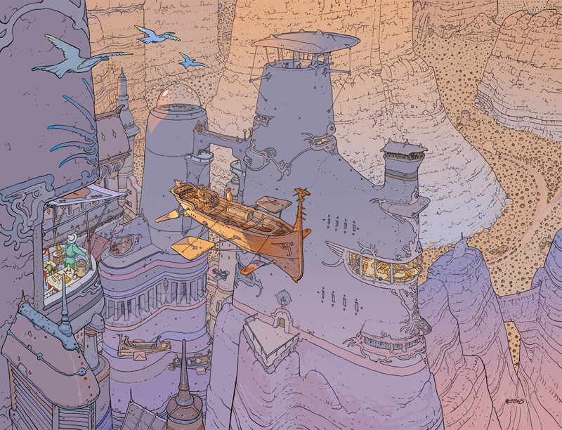
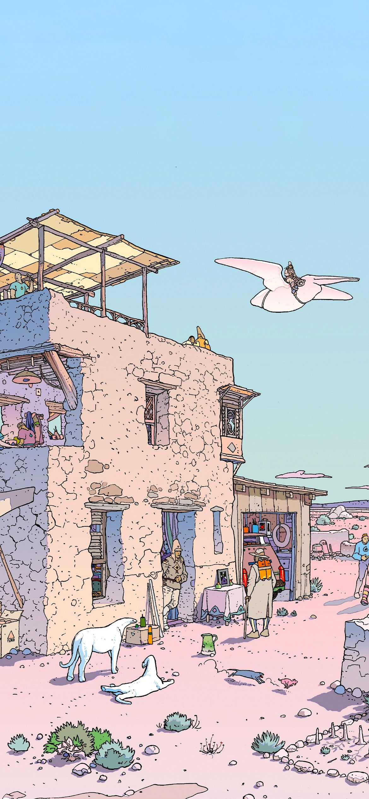
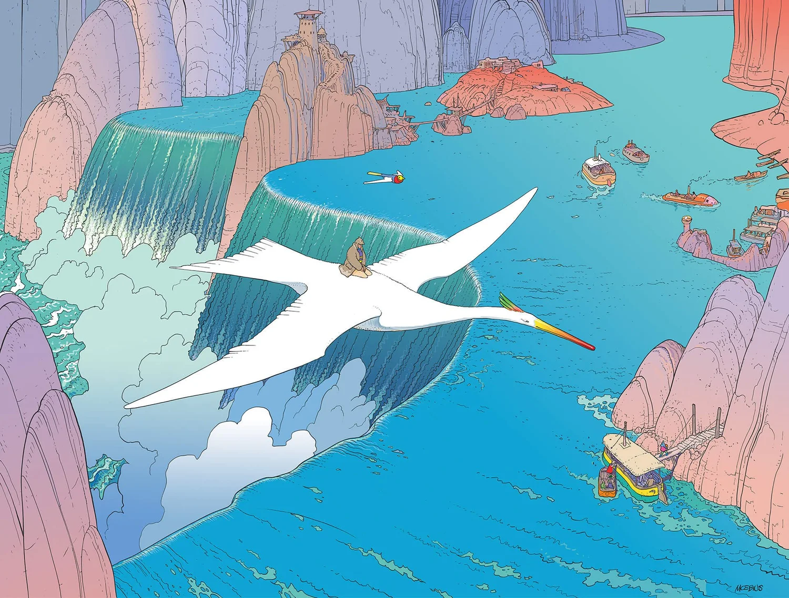
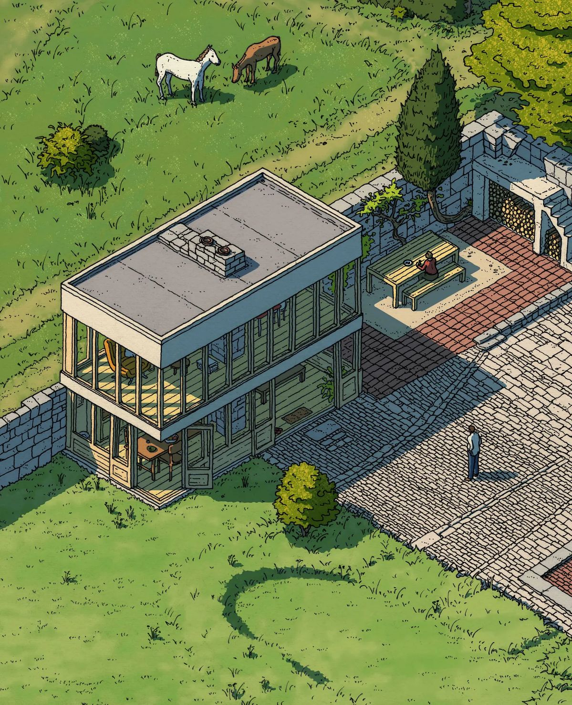
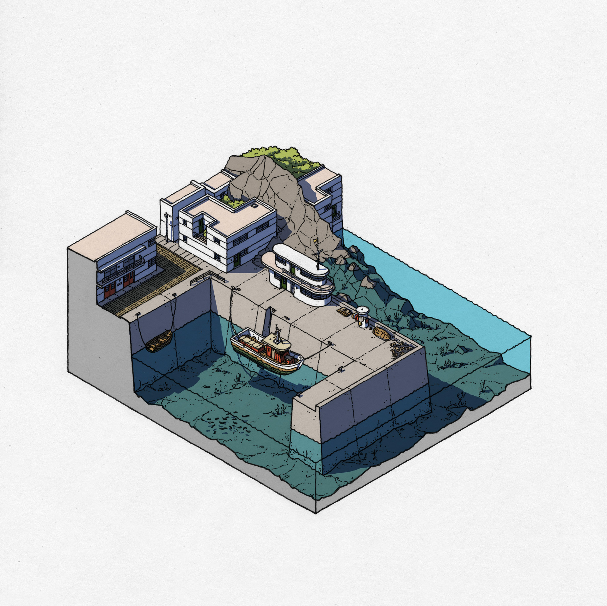
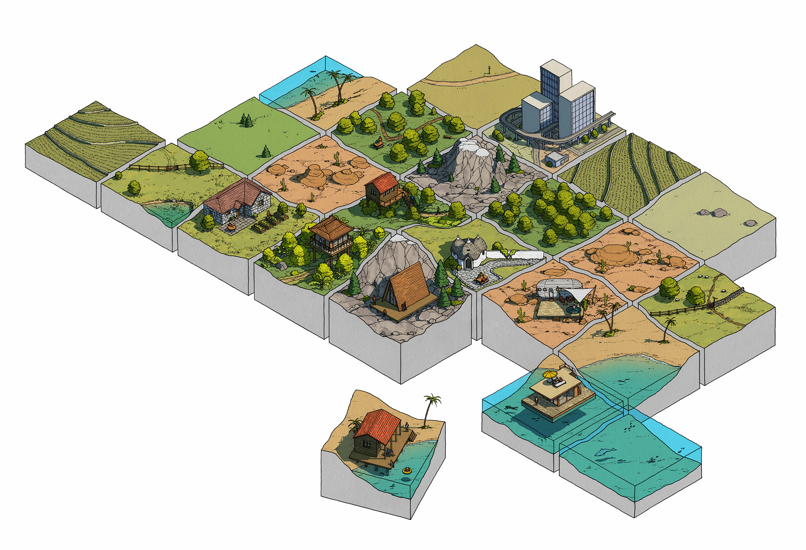
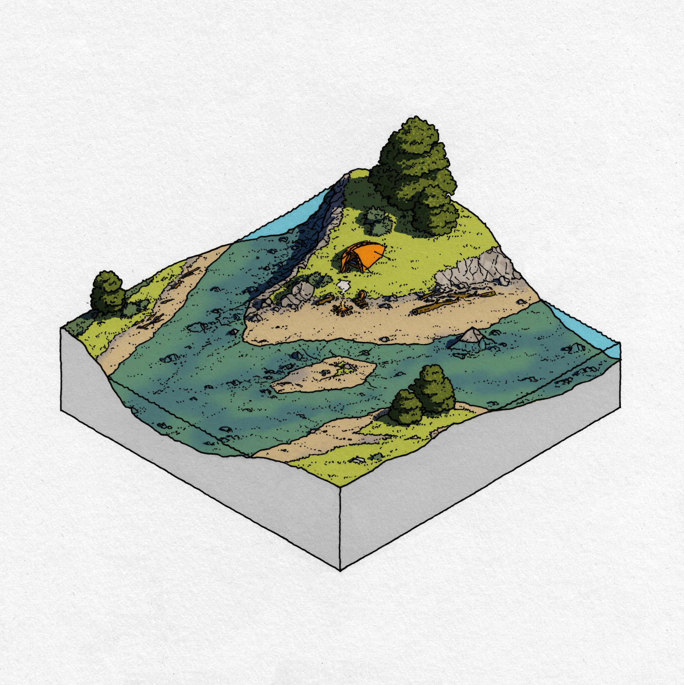
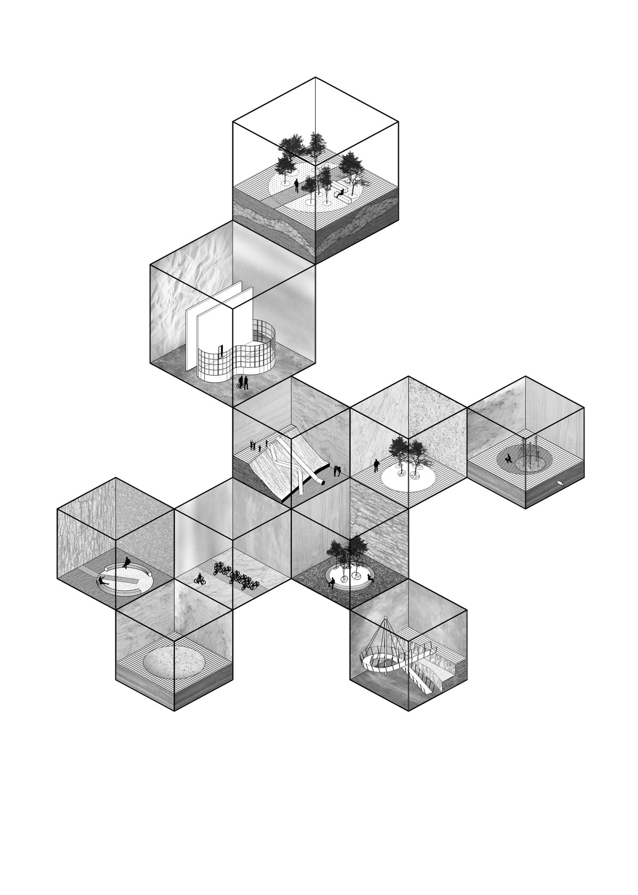
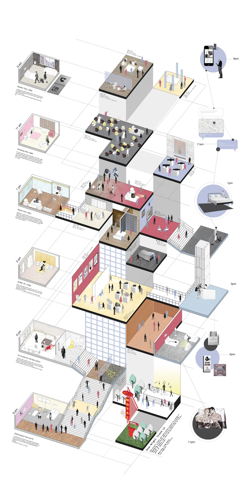

## Game Design Document

#### Game Overview
*Updated 15-09-2025 v0*
- **Core Concept**
The core concept of this game is to gradually reconstruct the protagonist's body through puzzle-solving and exploration of the scene. Players assume the role of a man who has lost fragments of his soul, exploring seven interconnected spaces. Each space represents a unique scene from the protagonist's memories. Players must solve puzzles, complete tasks, and collect body fragments. When all fragments are recovered, the protagonist will be restored to wholeness and reclaim his identity, leading the story to its final ending. Unlike traditional puzzle games, this title emphasizes not only logic and mechanics but also deeply integrates character growth with the puzzle-solving process. After acquiring body fragments, the protagonist gradually unlocks new abilities (such as switching perspectives or entering worlds of different scales), allowing players to access previously inaccessible areas. Through this growth journey, players progressively understand the game world's rules and learn to apply cross-space, cross-scale logic to solve puzzles. The game's uniqueness lies in the interweaving of memory, adventure, growth, and puzzle-solving. Players are not merely solving puzzles but embarking on a journey of self-reconstruction and exploration.

- **Related genre(s)**
	- Genres:
		- Main Genre: Puzzle Solving Adventure
		- Relevant Genre:  Spatial and Environmental Puzzle, Isometric View, Diorama, Abstract
	- Related game:
		- Monumental Valley
			- Isometric camera view
			- Optical and spacial illusion
		- Superliminal 
			- Scaling object through perception
		- The Room
			- Unlock layers of puzzles through interact with boxes
	- Differentiation
		- Our game has seven different space that are interconnected. Solving puzzles require travelling back and forth in these spaces.
		- Scale shifting mechanics that impacts both objects and players. Core of our game
		- Variety of gameplay in each room. Combine puzzle with other mini tasks like racing, fishing and building. But puzzle is the major gameplay.

- **Target Audience**
	- Players who enjoy cartoonish art style
	- Player who is patient about solving puzzles
	- Players who enjoy games like Monumental Valley, Inside, Superliminal, Manifold Garden etc.
	- Indie game lover

- **Unique Selling Points (USPs)**
    1. Scale shifting puzzle
		- Player change scale and proportion when entering different space. Objects they carried also changed, unlock possibility for new puzzle-solving methods.
	2. Various gameplay
		- Each space provide a unique mini tasks that introduced different gameplay.
	3. Cross space interaction
		- Interconnected seven spaces require players to go back and forth in each space to solve puzzle (with object shifting between each scale). Player should have a "grand scheme" to beat the game.
	4. Beautiful and unique Moebious Art Style

---

#### **Story and Narrative**

*Updated 15-09-2025 v0*

- **Backstory**
*Our game is not a heavily narrative-driven experience (not like an RPG). Instead, it tells its story through implication.*
The protagonist suffers a mental breakdown in middle age due to prolonged stress and anxiety, his consciousness pulled into a miniature inner world. Here, his memories become blocks of cages. Everyday spaces objects transform into giant mountainous obstacles or shrink into tiny gadgets. Childhood marbles roll like rocks, while school desks become a maze. The protagonist must explore his long-forgotten memories, experience this mysterious, alien space, solving puzzles to gradually reclaim fragments of himself, ultimately piecing together his body and soul.

- **Characters**
Protagonist: A middle-aged man crushed by stress, transformed into a tiny explorer within the miniature realm.

Memory Manifestations (interactive/static objects): Objects and memories transformed into story elements， such as giant marbles and massive desks, serve as both cherished recollections and trials to confront.

Inner World (space): Seven interconnected miniature scenes representing distinct stages of the protagonist's life and emotional memories.

---

#### **Gameplay and Mechanics**

*Updated 15-09-2025 v0*
- **Player Perspective**
This is a 3D game with isometric camera view. The camera will be fixed but will zoom in and out to follower player movement. The game level consists of seven connected room, player plays as our protagonist, moving and solving puzzle in each space.
- **Controls**
Player control the protagonist moving through simple mouse click on the floor of the space. Player can also interact with interactive objects through clicking, dragging, and placing or dropping. Correspondingly, this action will be represented as protagonist pick, pull, throw and drop objects. There are also static objects in the space where players can interact by completing tasks. Space will have mechanics and trap where player can click or drag to trigger. For instance, a player can click a lever to hold and drag using mouse to pull the lever.

- **Progression**
The game world consists of seven connected space in roughly cube space. The goal of the game is to solve puzzle and find "body fragment" hidden in each space, and when all body fragment are found, game ends. Each space represents a scene from the protagonist's memory. Each space will have a unique game mechanics and gameplay. Player will need to achieve different task to get body fragment and unlock the entrance to the next space.
Each space are interconnected, which sometime requires player to use objects from previous space to solve puzzle. As more space are unlocked by players, some objects in the previous space that seems useless become useful. The gameplay will start simple and become more and more difficult when more spaces are unlocked. In the last space, player will need to think and review all space they unlocked previously to solve the final puzzle.
We expect players to feel refreshing through the first few levels. 
As more spaces are unlocked, players will need to solve increasingly challenging puzzles. By the final stages, they will need to review and re-explore previous spaces, combining all the experiences they had to complete the game journey.
- **Gameplay Mechanics**
- Following are some major mechanics (more mechanics might be added when gameplay of different space change)
	1. Scale: 
		- Each space is in different scale, and when player entering a space, their scale will change accordingly.
		- Interactive object that user carry from one space to another will also scale accordingly.
		- Player can throw object through certain entrance, the scale of the object will change accordingly when passing through the entrance.
		- Player's strength will increase or decrease when they grow or shrink in scale. Allowing them to interact with heavy object when they grow.
		- Player will be heavy in large scale, and light in small scale.
	2. Object
		- Player can interact with interactive object, but they cannot interactive with static object unless they achieve certain task.
		- Object has material and weight. Fragile object can be break by hard object. 
	3. Player
		- Player cannot jump, run, or climb a wall without any tools. 
		- Player can acquire ability when they get each body fragment.
		- Player can shrink or grow when passing the space entrances or through ability.

---

#### **Levels and World Design**

*Updated 15-09-2025 v0*
- **Game World**
This is a 3D game with isometric view. Camera will remain fixed but will zoom in and out accordingly. When player move in the space, the camera will also follows their movement smoothly, but it will always fixed to a isometric view. The game world consists of seven connected spaces, where each space is a separate diorama in a roughly cube shape. Player will need to solve puzzles, complete certain tasks (like racing or fishing) to acquire "body fragment" in a space, which will give the protagonist new ability and unlock the entrance to the next space. Each space will have different game mechanic and gameplay. The major game mechanic is that when player entering a space, they will either shrink or grow according to the set of relevant space. Any object they carried will also change to the scale of the space, which is crucial to solve puzzle. As an example, players will find themself moving from one space to another to get use of this scale-changing mechanic to change a scale of an object, which will solve a certain puzzle.

- **Objects**
	- Background
		- All background objects (set, furnitures, trees etc.) is static unless there is a special mechanic attached to it. Background scenery like sky and mountain will demonstrated using a image for optimisation purpose.
	- Interactive object
		- Interactive object includes objects where players use to solve puzzle and all the relevant dynamic design. This includes:
			- Chest fragments: From protagonist and locate in different spaces. When play successfully acquire it, it will automatically fit into players body and give player a certain abilities.
			- "Doors" (or other objects that allow players to go into another space): Through each "door", player will shrink or grow according to the space they went to, There will also be 3D to 2D shifting mechanics when using some doors.
			- Static objects: Static object refers to object that cannot be moved. But it can be acquire through specific task. For instance, a rock that blocks the way.
			- Interactive objects: Interactive objects refers to object that can be moved or collected by player. 
			- All objects will be listed here later.
- **Physics**
	- This game follows basic daily-life physics.
	- Protagonist can shrink or grow. When this happened, player will lose or gain strength that limited how they can interact with other objects. Their collisions will also change accordingly.
	- Static object cannot be moved, but can be break according to its material. For instance, glass wall can be break by throwing a rock.
	- Interactive objects can be moved. Each objects has different materials that follows the physics of the real world. Interactive object has weight, when player gain strength through changing scale, they will be able to move object with large weight.
	- Player can throw, drop, push, pull, and grab interactive object. 
	- Player cannot jump or climb a wall. 

---

#### **Art and Audio**

*Updated 15-09-2025 v0*

- **Art Style**
Our game will adopt a comic/cartoon style art direction, featuring Moebius Art style. Following are some references of Moebius Art Style.

Following are some other Moebius art style we are looking.

  

  

  

  

  

  

  

Some other references showing what our game level might look like:

  

  

- **Sound and Music**
  Sound and Music will focus on the theme of relaxing and calm. As our protagonist will experienced through their different memories, background music will also shift according to the scene. But the major tone is peaceful, gentle and soothing, implying our theme of healing and recovering yourself.

- **Assets:**
  We will be using art assets including models, textures, music and sound from online. We will also use Blender to create our own models. We will write our own shaders and integrate with these assets to achieve our intended art and render style.
  This part will be updated continuously. Following are some current source for our models:
- https://free3d.com/3d-models/obj
- https://assetstore.unity.com/zh-CN?srsltid=AfmBOorV8fOIl4uve9E7rTyQU-1u_tY34TRIlJg6N9vLlGTgYqO3Smv6
- https://www.gamedevmarket.net/

---

#### User Interface (UI)

*Updated 15-09-2025 v0*
UI design has relatively low priority, this will be updated later when games' features are completed.
**Concept**

- Minimalist art style, simple and clear to use.
- Considering our game is a puzzle game, all interfaces should maintain minimum amount of buttons and notifications. Allowing players to fully immersed in the world and focused on puzzle-solving experience.
**Illustrations**

---

#### Technology and Tools

*Updated 15-09-2025 v0*

- **Development Tools**
	- Unity 6.1.000.1.14f1
	- GitHub/GitHub Desktop
	- Rider
	- VSCODE
- **Art and Audio tools**
	- FMOD 2.03.09
		- FMOD for Unity 2.03.09 (Integration)
	- Blender
	- Affinity Designer 2
- **Collaboration and Management**
	- Trello
	- Miro
	- WeChat

---

#### Team Communication, Timelines and Task Assignment

*Updated 15-09-2025 v0*

- **Role**

| Team Member | Specialised role             |
| ----------- | ---------------------------- |
| Joly Lin    | Art and Testing Analysis     |
| Yue Wang    | Audio and Visual Design      |
| Yao Chen    | Programming and level design |

| Shared Task                             |
| --------------------------------------- |
| 1. Game Design                       |
| 2. Shader Development                   |
| 3. Art assets (model, texture, )        |
| 4. Integration between different assets |
|                                         |

- Each team member has a specialised role and task that they are responsible for managing and making decisions. We all will collaborate and contribute to shared task.

- **Collaboration Principle**
	1. All team members should constantly share their progress, ensure transparency.
	2. All team members should active engaged in team discussion and meeting
	3. Tasks should be balanced among team members.
- **Communication Method**
	- Communication Tool: WeChat
	- Team Meeting: 
		- Update Meeting: Every Wednesday 16pm
			- Team members update progress and discuss problems.
		- Weekly Review: Every Sunday 14pm
			- Team members share progress and discuss direction and tasks for next week.

- **Task Management**
	- Following is a copy of our Trello task management that will keep updating throughout the project.

| Development Process    | Plan                                                         |
| ---------------------- | ------------------------------------------------------------ |
| Week 1 (15/9 - 21/9)   | - Set up the development environment and complete the basic framework.    - Refine the light card design.   - Prepare the art and music assets - Finish prototype |
| Week 2 (22/9 - 28/9)   | Implement core mechanics. Finish scene design                |
| Week 3 (29/9 - 5/10)   | Implement core mechanics. Construct scene in Unity           |
| Week 4 (6/10 - 12/10)  | Integrate. Finish basic UI design                            |
| Milestone 4 Submission | Test and Review                                              |
| *Update later*         |                                                              |
---

#### Possible Challenges

| Risk Statement                                               | Mitigation Strategy                                          |
| ------------------------------------------------------------ | ------------------------------------------------------------ |
| Team member not very skilled at Unity                        | Team member should improve Unity skills through various ways. Watch online tutorials by Unity and practice using official game project. |
| We have learned Java before but development in C# can still be challenging. | Check Unity documentation for C#. Watch online tutorials and examples. |
| We do not have video game development experience, time management might be challenging. | Balance tasks and set reasonable goals for each week. Build the basic playable structure first, then start building complex mechanics. If a certain mechanic is too difficult to implement, hold a meeting to discuss whether to change it or not. |
| Art or audio assets can be possibly delayed                  | Use simple placeholder models to ensure mechanics and features are completed to meet milestone requirement. |
| Absent or illness                                            | Tasks should be reallocated properly. Other team members should assist in completing unfinished tasks, |

