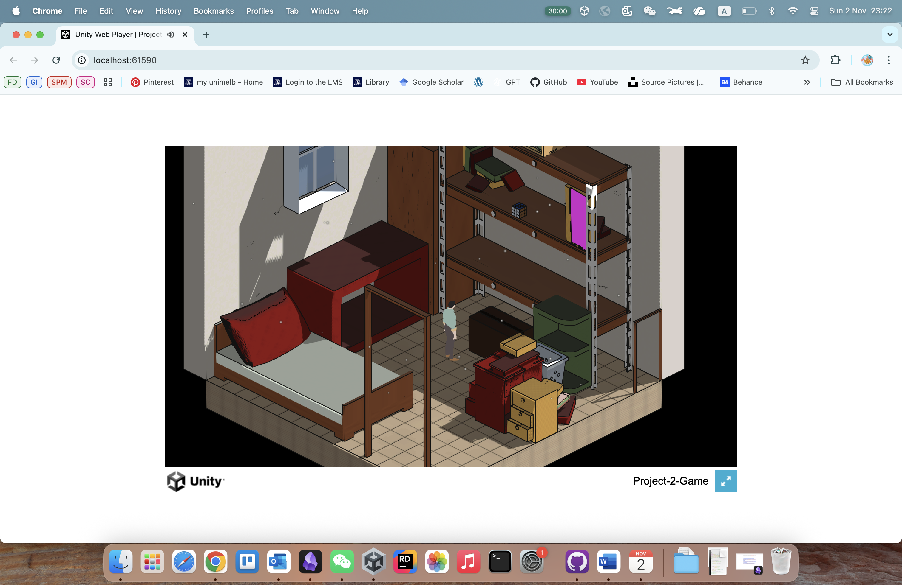
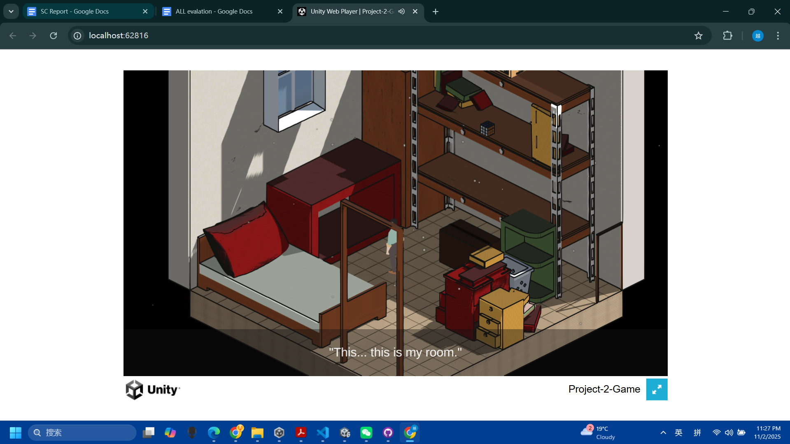

# Project 2 Report

Read the [project 2
specification](https://github.com/feit-comp30019/project-2-specification) for
details on what needs to be covered here. You may modify this template as you
see fit, but please keep the same general structure and headings.

Remember that you should maintain the Game Design Document (GDD) in the
`README.md` file (as discussed in the specification). We've provided a
placeholder for it [here](README.md).

## Table of Contents

- [Important Reminders](#evaluation-plan)

- [Evaluation Plan](#evaluation-plan)
- [Evaluation Report](#evaluation-report)
- [Shaders and Special Effects](#shaders-and-special-effects)
- [Summary of Contributions](#summary-of-contributions)
- [References and External Resources](#references-and-external-resources)

## Important Reminder

There are some important issues in our game that need to be addressed.

**Web build issue**

During the development, we found that when using MacOS system to web build and run our game, there is a pink glitch (see below figures). However, when using WindowsOS system to web build and run, there is no such issue. It comes to our conclusion that this is an operating-system level issues that we cannot solved by debugging in Unity. Therefore, we **strongly encourage to play our game in Windows system**. 

  

    <em>Outworld</em> 
    
  

  

    <em>Outworld</em> 
    
  

**Game Playthrough Video**

We understand that our puzzle game might be challenging. Following are a complete playthrough of our game.

## Evaluation Plan

**Evaluation techniques**: 

- Observational methods: think-aloud, post-task walkthroughs. 
- Querying technique: questionnaires.

We adopt think-aloud and post-task walkthroughs during observations. Because our game has elements of puzzle-solving, think-aloud method can reveal players’ reasoning paths in our puzzle pattern recognition, deduction, and cross-space logic. Think-aloud also exposes points of confusion early by hearing player's real-time expression. And it requires only screen/audio recording which is low setup cost. With the screen/audio recording, we will further conduct post-task walkthroughs to better understand players' reasoning. We will also ask questions to access users' overall emotional engagement and narrative comprehension of the game. With these two observational methods together, we want to encourage deeper verbalization without breaking too much immersion. For querting technique, we use questionnaires with ten fixed questions, each question scaling from 1 to 5 (Strongly disgree, disagree, neutral, agree, strongly agree). We will ask the players to play the game with the tasks to find the exit of the first room space; and to move the buildings in the second room space.

**Think-abloud & Post-task walkthrough: 3~5 questions**: 
- Why did you make certain movements (based on player's behaviours and observer's notes)?
- Why did you express certain feelings (based on player's emotions, confused, frustrated or excited)?
- How long did it take you to feel “comfortable” with how the game works?
- Describe any moments when the game did not behave as you expected.

**Questionnaire: 10 scaled questions**: (Strongly disgree, disagree, neutral, agree, strongly agree)
1. The character control and interactions were comfortable and intuitive.
2. The frame rate and animation felt smooth during play.
3. It was clear what I needed to do to progress or escape from the start.
4. I understood the time transition represented by the moon and building in the work space.
5. The layout of the environment felt logical and cohesive.
6. I understood the connection between the two rooms (“life” and “work”) and the larger space.
7. The visual (lighting, color, text) enhanced the experience of exploring.
8. The sound effects and/or background music enhanced the experience.
9. The overall performance met my expectations for a playable prototype.
10. The gameplay felt engaging and coherent.

**Participants**: Our target audience is mainly university students who enjoy narrative-driven puzzle games, stylish indie games, and exploration. We also include some causal players who play games less often, but enjoy aesthetics/emotion. To ensure the representativeness, we aim to balance game familiarity (70% who play games often, 30% otherwise) and gender (males/females).

**Stratified quota sampling**: 
- Cartoon-style/Indie game players: 4 (40%)
- Patient puzzle / exploration players: 4 (40%)
- Casual players: 2 (20%)

**Recruitment channel**: 
- University / campus participant pools — target students in arts/CS/games courses.
- Social media (Facebook/Instagram) with a short playtest call.
- Mutual friends who play games. 

**Data collection**:
- For think-aloud observation, we will collect qualitative (descriptive) data from observation and field notes.
- For post-task walkthroughs, we will collect qualitative (descriptive) data when showing transcripts/footage of what they did. 
- For questionnaires, we will collect quantitative data from ten written questions scaled from 1-5 to evaluate perceived usability, enjoyment, difficulty, immersion, and narrative understanding.  

**Data analysis**:
- For qualitative data, we will categorize all player quotes into aspects such as "Understanding goal", "Confusion/Misinterpretation", "Feedback Recognition" and "Emotional responses". This way helps us to analyse overall players' real-time reactions and know what aspect to be addressed. 
- For quantitative data, we will address following aspects: Logics clarity, Feedback Responsiveness, Narrative Engagement, Satisfaction / Flow. With scalar 1-5, we aim to get an average score of 4 in every aspect. 

**Timeline**: 
- We will conduct our evaluations with our improved (with animation & special effect) Demo game (from the 20th to the 27th of October) and complete the final game by Milestone 6. Report to be done by Milestone 6. 

**Responsibility**
- Patrick to improve game levels and overall developments based on player feedbacks. 
- Ryan to add the sound/music effect, models and finalise shaders. 
- Joly to add animations and special effect and conduct data analysis. 
- Every team needs to conduct game evaluation with 4 players and collect data.

## Evaluation Report

From think-aloud notes and posttask walkthroughs, we noted down the following qualitative data: 
- Most participants found the gameplay unclear when the LifeRoom started. Due to limitied interactions in the first stage, some users expreesed "**Confused**" feelings.
- After 1-2 minutes average when participants exited from the first door and entered another space (OutWorld), 7 users showed **excitement** and had a good understanding of the door/size transitions between the rooms.
- When the XS size player entered into the first room, half of the participants expressed "**interesting**" while the other half of participants found it "confusing".
- Two unexpected bugs happened to 4 paricipants when the player accidentally entered into the books and the screen started shaking. -- Had to stop the gameplay which caused **disappointment**. 
- During XS size player's exploration in the first room, 6 participants found the movement&control a bit tricky. Since only specific areas can trigger the movement, this technical issue caused some **frustrations**. And walking-stairs animation was still imcompelte, this didn't meet users' expections either.
- In the third scene (WorkRoom), half of the participants expressed "it's quite **difficult** to control the big model".
- 4 participants spent more than 10mins finishing the game; 3 participants spent 8~10 minutes; 3 participants didn't finish the game.

Here is a detailed summary of the questionnaire results and changes we have made to the game. 
| **Question* | **Gameplay Area Addressed** | **Average scores** | **Participants' Feedback** | **Changes** | 
|-------|-------------------|--------|----------------------------|-----------------------------|
| Q1 | Control & Interaction design | 3.0 | While the mouse control of player movement felt intuitive, it was hard to control since most evaluations were done on a Mac with TrackPad. | No changes to the game. Suggestion is to use a physical mouse to play. | 
| Q2 | Technical performance | 3.6 | There were two bugs tested out during evaluations when the player walks into hidden areas or accidentally into objects. Jumping and climbing animations were not completed. | Walking up animations and specified walkable areas were further improved | 
| Q3 | Gameplay clarity | 3.5 | It was challanging for half of the users to understand how to progress the game, partially because they didn't watch trailer as well. Some users think it's acceptable that a puzzle game takes a bit longer than usual games to figure out the goal/progression. | A UI intro page was added at the start of the game for more clarity. | 
| Q4 | Narrative communication | 3.5 | The background transition was not complete. | Background change and UI for story dialogue |
| Q5 | Level design | 4.0 |  The bedroom and workplace layout look pretty and natural. | No change - met overall expectation. |
| Q6 | Narrative communication | 3.5 | Without watching trailer or brief introduction of the game background, it's hard to know meaning of rooms. Object interactions seem quite random and not strongly logical, it's hard to connect into a story and meanings. | UI for story dialogue | 
| Q7 | Visual design | 4.0 | Visual elements look decent yet simple. Limited to three small spaces. |  No change - met overall expectation | 
| Q8 | Audio design | 4.0 | The music feels natural and comfortable. Not too relevant with player itself.  |  No change - met overall expectation. | 
| Q9 | Overall experience | 3.9 | It's a playable game however can be very hard to play. | Created some glow and outline effects for hints. | 
| Q10 | Engagement | 4.0 | At this stage, it's lack of excitement and interactions with different objects. With more developed elements, it'd be an interesting game to play. |   | 

Based on the evaluations above, we made following changes in the game:
- Player movement improved with specified walkable areas and consistent animations.
- UI text for story narrative added at the start and the end.
- UI videos for hints.
- Outline effects and camera adjustment for hints.

## Shaders and Special Effects

Here are two custome vertex and fragment shaders used in the game: 

#### Shader 1 – Moebius/Flat Color With Normal Detail
**File path**: Assets/Shaders/Moebius/FlatColorWithNormalDetail.shader

This shader is mainly used to create a hand-drawn style for the room scene in our game. It makes objects look like they are painted flat, similar to illustrations. In addition, simple lighting and rim highlights were also added on to give it some depth, so the scene not look too plain. This shader is applied to most objects in the “RoomLife” scene, including the bed, table, and walls. Its material parameters are open to change, so we could directly adjust color, gradient range, or normal texture in the editor and see results right away. All textures were added as images and fine-tuned with parameters, without creating new materials or changing code. This significantly reduced the workload, allowing for faster and more flexible style adjustments. 

**Main features**:
- Adds a color gradient based on the object’s height in the world. For example, the top part of a wall can look brighter than the bottom.
- Supports different texture mapping modes (model UV, world XZ, or triplanar) to avoid visible seams between modular objects.
- The normal map can follow the same world-space direction as the texture, so the surface looks more natural.
- Includes a simple, stylized highlight band where the thickness and brightness can be adjusted.
- Adds rim light to make objects stand out more clearly from the background.

#### Shader 2 - Moebius/Sobel Outline_Fullscreen
**File path**: Assets/Shaders/Moebius/SobelOutline_Fullscreen.shader

This shader was used to make the whole scene look more like a comic or hand-drawn artwork. It added an outline layer over the image, so we didn’t need to create a separate outline pass for every material. It also let us control the thickness of the lines globally in one place. A second pass was also added that used the stencil buffer to exclude the player character, so the outline did not cover the player model. The player’s material wrote a stencil value, and the outline shader only drew on areas where the stencil value was different. This made the outline effect work smoothly with the rest of the rendering system.The basic Moebius flat shader gave nice pastel colors, but without outlines, the scene looked too clean and 3D-like. It accessed the final color, depth, and normal information, then drew outlines over the whole screen. It kept the visual style unified so we don't have to create separate materials for every object. 

**Main featuers**:
- The shader reads the camera depth texture and normal texture provided by Unity.
- It uses the Sobel algorithm to detect edges from both the depth and normal textures, then combines the two results.
- _DepthScale and _NormalScale control whether the outlines are more affected by depth changes or by surface details.
- _EdgeThreshold and _EdgeSoftness change the line intensity and smoothness, while _Overlay decides whether the lines are drawn over the original image or shown alone.

Before adding these 2 shaders: 

After adding flat color and normal details:

 

After adding sobel outline shader:

#### Particle System

The particle system was made to add dust effects to enhance environmental atmosphere based on the story theme, where the player found himself in bedroom and lost memory.

## Summary of Contributions

Since all of us were not very familar with Unity and GitHub and concerned about conflicts on GitHub commits, we all worked on the same laptop at the start. 

- Yue Wang: Visual arts, audio design, models, shaders
- Yao Chen: Game evel design, player control, programming 
- Joly Lin: Anaimation, outline shaders, particle system, evaluation analysis

## References and External Resources

Shader: https://www.youtube.com/watch?v=jlKNOirh66E

https://www.youtube.com/watch?v=1QPA3s0S3Oo&list=PLAUha41PUKAaYVYT7QwxOtiUllckLZrir&index=1

Player animation clips: https://www.mixamo.com/#/

Tutorials for Unity and programming:https://www.youtube.com/watch?v=sBHpUi71eno

https://www.youtube.com/watch?v=DX7HyN7oJjE

https://www.youtube.com/watch?v=SMWxCpLvrcc

https://www.youtube.com/watch?v=P_ibDJhFVMU

https://www.youtube.com/watch?v=7wjYbAC0c6k

https://docs.unity3d.com/6000.2/Documentation/Manual/scripting.html

